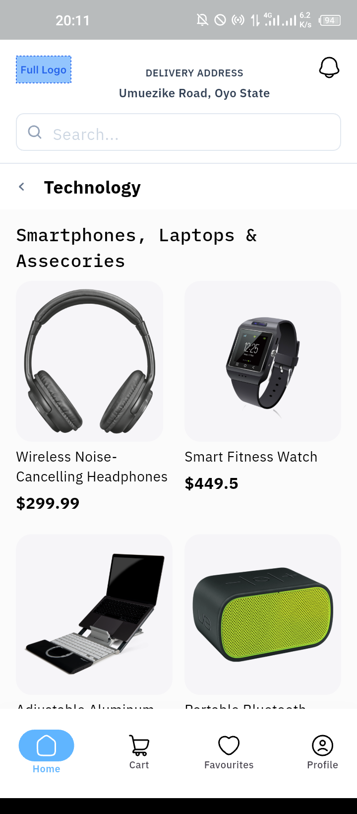

# E-Commerce Mobile App

A Flutter-based mobile application that provides a complete shopping experience with product browsing, detailed product views, and cart management functionality.

## 📱 App Overview

This mobile application allows users to browse products, view detailed information, and manage their shopping cart with an intuitive user interface. The app features a clean design with smooth navigation and real-time cart updates.

## 🛠️ Tech Stack

- **Framework**: Flutter
- **Language**: Dart
- **State Management**: Riverpod
- **UI Components**: Material Design
- **Data Storage**: Static Arrays
- **Navigation**: Flutter Navigator 2.0

## ✨ Features

### 🏠 Home Page / Product Listing
- Scrollable grid layout of product cards
- Each product displays:
 - Product image
 - Product name
 - Product price
- Search functionality

### 📋 Product Details
- Large product image display
- Comprehensive product information
- Product specifications and features
- "Add to Cart" button with visual feedback
- Toast notifications for cart updates

### 🛒 Shopping Cart
- Complete cart management system
- Quantity adjustment (+ / - buttons)
- Individual item removal
- Price calculations:
 - Subtotal calculation
 - Shipping fee display
 - Total amount calculation
- Empty cart state with helpful messaging

### 🧭 Navigation
- Bottom navigation bar with:
  - Home
  - Cart (with live badge counter)
  - Favourites
  - Profile
- Smooth screen transitions
- Back navigation support

## 📸 Screenshots

### Product Listing

*Product listing*

### Product Search

*Browse products with search functionality and category filtering*

### Product Details

*Detailed product view with specifications and add to cart functionality*

### Product Detail (Out of stock)

*Product not in stock*

### Empty Cart State

*Empty cart state*

### Cart List

*Dynamic cart updates*

## 🚀 Setup Instructions

### Prerequisites
- Flutter SDK (version 3.0+)
- Dart SDK
- Android Studio / VS Code
- Android device or emulator

# 📦 Download APK

**Direct Download Link:** [Download APK](https://drive.google.com/file/d/1R7sXdqevjTXxnPSofnvLyjZIoIMbfvgg/view?usp=drive_link)  
> _Note: The APK is publicly accessible and doesn't require special permissions._

---

## 🔧 Key Implementation Details

### 🗂️ State Management
- Implements efficient state management for cart operations  
- Real-time updates across all screens  
- Persistent cart state during app session  

### 📊 Data Handling
- Static product data loaded from local JSON  
- Efficient product filtering and search  
- Error handling for data loading scenarios  

### 🎨 UI/UX Features
- Follows Material Design principles  
- Responsive layout for different screen sizes  
- Smooth animations and transitions  
- Toast notifications for user feedback  
- Loading states and error handling  

### 🛒 Cart Functionality
- Add/remove products  
- Quantity management  
- Price calculations  
- Cart badge counter updates  
- Empty cart state handling  

---

## 🎯 User Flow

1. **Product Discovery:** Users browse products on the home screen  
2. **Product Selection:** Tap on product cards to view details  
3. **Add to Cart:** Add products with immediate visual feedback  
4. **Cart Management:** View, modify, and manage cart contents  
5. **Checkout Ready:** Complete cart with total calculations  

---

## 🧪 Testing

The app has been tested for:

- ✅ Smooth navigation between screens  
- ✅ Cart state persistence  
- ✅ UI responsiveness  
- ✅ Error handling scenarios  
- ✅ Product search and filtering  
- ✅ Quantity management  
- ✅ Price calculations  

---

## 📋 Requirements Fulfilled

- ✅ Product listing with images, names, and prices  
- ✅ Product detail screen with full information  
- ✅ Cart functionality with add/remove/quantity controls  
- ✅ Bottom navigation with cart badge counter  
- ✅ Toast notifications for cart updates  
- ✅ Search and filtering capabilities  
- ✅ Responsive UI design  
- ✅ State management implementation  
- ✅ Error handling and empty states  

### Installation Steps

1. **Clone the repository**

   
   `https://github.com/yourusername/ecommerce-mobile-app.git
   cd ecommerce-mobile-app`

2. **Install dependencies**

    `flutter pub get` 

3. **Run the application**

    `flutter run` 

4. **Build APK (optional)**

    `flutter build apk --release`

  
